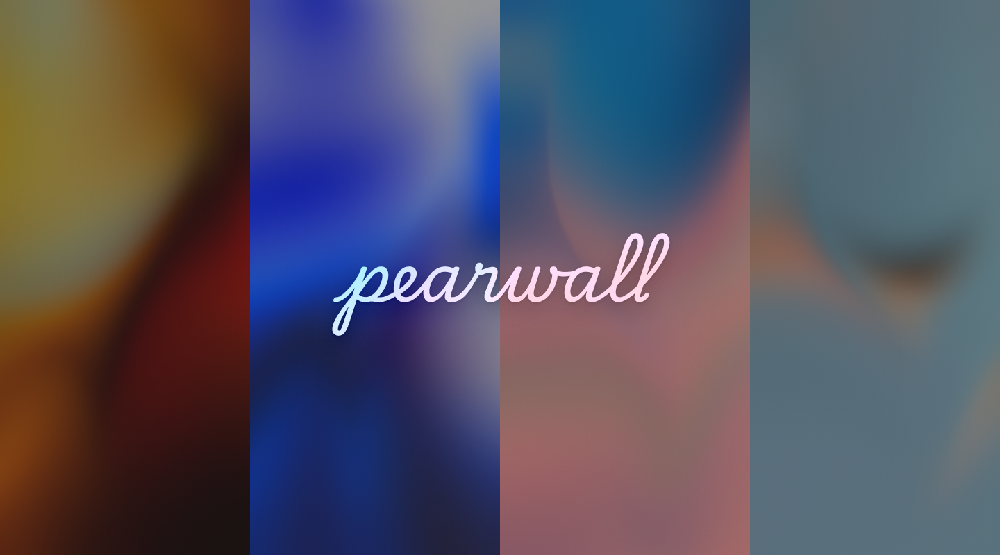

  

<h1 align="center">Pear Wall</h1>

  一款会随音乐封面与节奏变化的 Android 动态壁纸。

  
  
  
  

## 简介

Pear Wall 将正在播放的媒体封面渲染成受 Apple Music 启发的网格渐变动态壁纸。
支持使用系统音频节奏驱动动画，为低音和鼓点添加动态反馈。

## 功能

- **动态封面壁纸**：从媒体通知读取当前播放内容的专辑封面并实时更新壁纸。
- **Pear Mesh 渲染**：基于 OpenGL ES 3.0 的流动网格效果。
- **音频可视化**：分析系统输出音频的低频、节奏和瞬态变化，驱动壁纸动画。
- **长虹玻璃效果**：可关闭，或选择窄、宽、平滑等不同效果。
- **视频播放器过滤**：可屏蔽内置黑名单中的媒体通知和封面。
- **画面导出**：点击设置页顶部标题区域，可将当前壁纸画面导出到 `Pictures/PearWall`。
- **息屏与省电处理**：屏幕不可交互或进入息屏状态时自动暂停渲染，减少不必要的功耗。

## 安装

### 直接安装 APK

当前仅打包 `arm64-v8a` 架构，要求 Android 10（API 29）或更高版本。

### 首次使用

1. 打开 Pear Wall。
2. 在设置页授予 **通知使用权**，用于读取正在播放的媒体封面。
3. 如果需要音频可视化，授予 **麦克风权限**。该权限仅用于捕获系统输出音频进行节奏分析。本应用不会联网，也不会通过该权限获取您的隐私。
4. 点击"设为动态壁纸"，在系统壁纸选择器中确认使用 Pear Wall。

## 权限说明

| 权限                    | 用途                              |
|-------------------------|-----------------------------------|
| 通知使用权              | 读取正在播放的媒体信息与封面      |
| `RECORD_AUDIO`          | 获取音频数据并进行音频可视化分析  |
| `MODIFY_AUDIO_SETTINGS` | 配合音频采集与音频分析            |
| 动态壁纸相关系统权限    | 注册并运行 Pear Wall 动态壁纸服务 |

音频可视化是可选功能。关闭后不会启动音频分析器。

## 开源许可

本项目采用 [Apache License 2.0](LICENSE) 许可证。详见项目根目录的 `LICENSE` 文件。

## 致谢

特别感谢：Lyricify Backgrounds.

此外完整依赖信息可在应用内和 `app/config/libraries/` 中查看。
